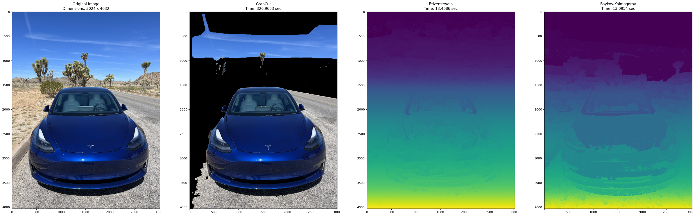
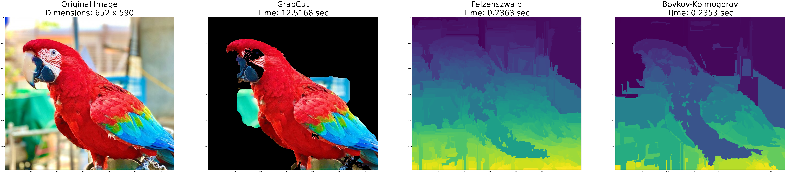
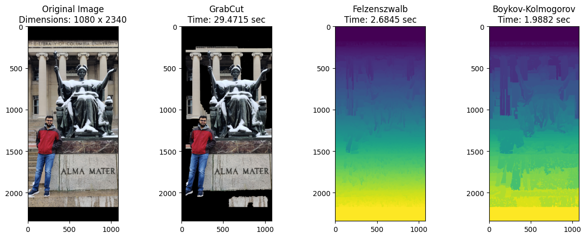
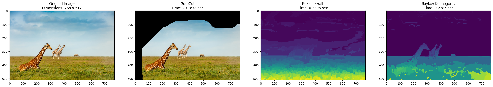
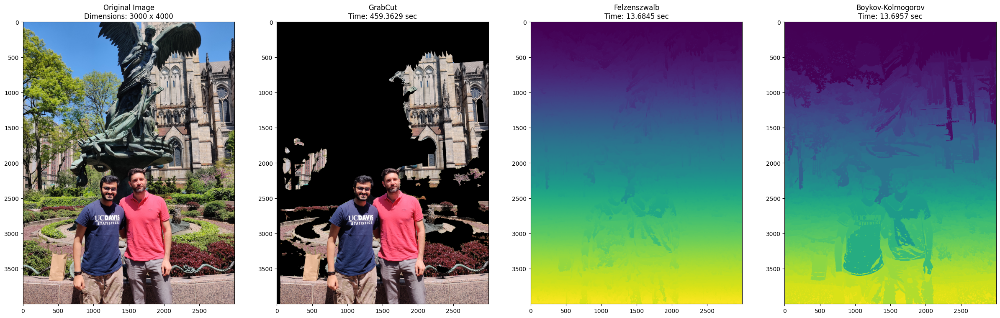
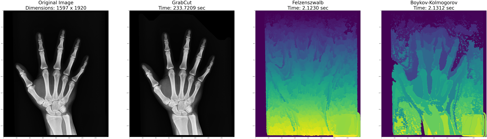
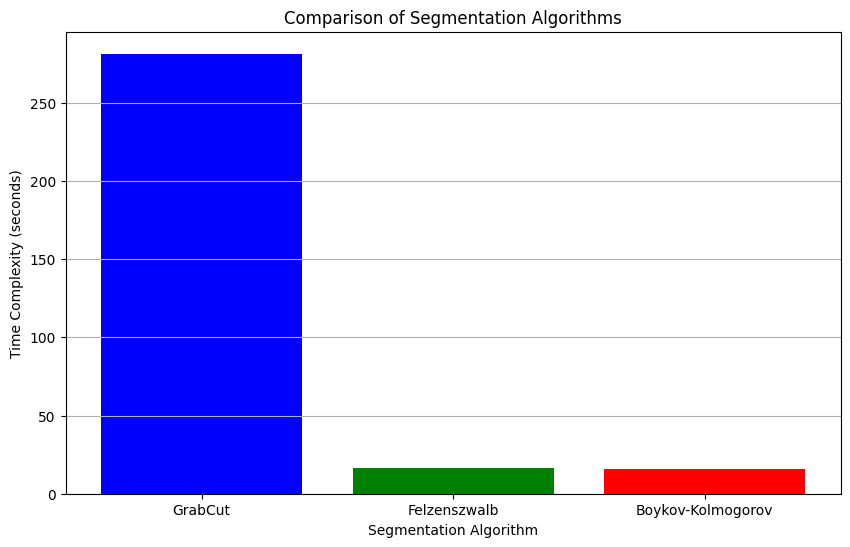

# Image Segmentation via Minimum Cut/Maximum Flow

## Website

For a detailed report, please visit https://dpjani.github.io/image-segmentation/. 

## Examples

<!-- *Caption for Image 1* -->

<!-- *Caption for Image 1* -->

<!-- *Caption for Image 1* -->

<!-- *Caption for Image 1* -->

<!-- *Caption for Image 1* -->

<!-- *Caption for Image 1* -->

## Results

**Time-Complexity comparision for image-segmentation using GrabCut method, Felzenszwalb and Boykov-Kolmogorov algorithm.**
