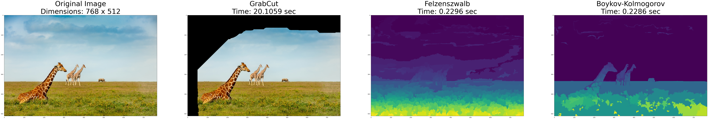

# Image Segmentation via Minimum Cut/Maximum Flow 

## Final Report

A detailed report is available [here](https://dpjani.github.io/image-segmentation/.) 

## Examples

<!-- *Caption for Image 1* -->

<!-- *Caption for Image 1* -->

<!-- *Caption for Image 1* -->

<!-- *Caption for Image 1* -->

<!-- *Caption for Image 1* -->

<!-- *Caption for Image 1* -->

## Results

    
    
    

* An example of simple Vehicle Routing Graph problem solved using Min-Cut Algorithm and Karger's Algorithm.  
* Min-Cut has better time-complexity than Karger's Algorithm.

* Time Complexity: Min-Cut VS Karger's Algorithm for simple graph with n nodes

* Image segmentation on an image using Minimum-Cut/Maximum-Flow Algorithm

* Time-Complexity comparision for image-segmentation using GrabCut method, Felzenszwalb and Boykov-Kolmogorov algorithm.

## Conclusion

1. Minimum Cut algorithm performs better in time complexity & optimality than Karger's algorithm for directed graphs. On the contrary, Karger outperforms Minimum Cut when robustness to noise is prioritized over optimality. Karger's algorithm runs in $O(|V|)^2$ time which has higher probability of success than Minimum Cut method whose time complexity is generally $O(|V|)^3 $.
2. GrabCut methods provide good results for medium-sized images but is computationally expensive for large images resulting in bad time complexity.
3. Felzenszwalb's Algorithm does not guarantee optimal solution for image segmentation but provides a fast-efficient method for generating super-pixels. It offers linearithmic time complexity which is suitable for real-time and interactive segmentation techniques.
4. Boykov-Kolmogorov offer the most optimal and efficient image segmentation results as compared to the above methods. It can handle complex and large images.

## Improvements

* There is scope of improvement by using some efficient algorithms like Push-Relable algorithm, Mean-Shift algorithm, and CNNs/FCNS (Deep-Learning segmentation techniques)
* Improvements can also be done by parameter tuning, feature selection, and image pre-processing.

## Acknowledgments

* Final project for Computational Discrete Optimization (IEOR 4008) at Columbia University, Spring 2024.
* Special thanks to [Prof. Yuri Faenza](https://www.columbia.edu/~yf2414/) for the support. 
